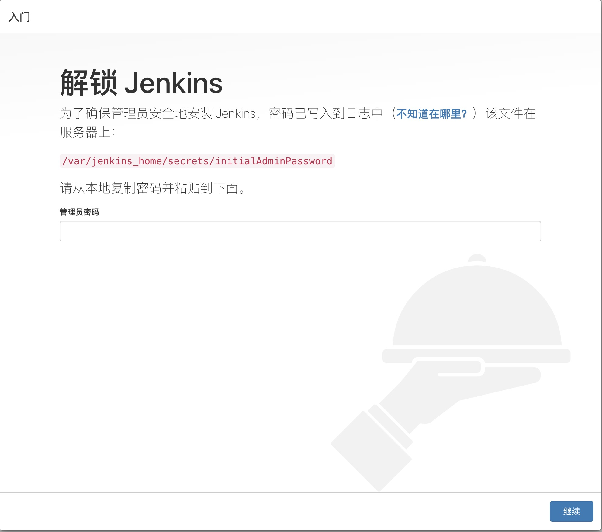
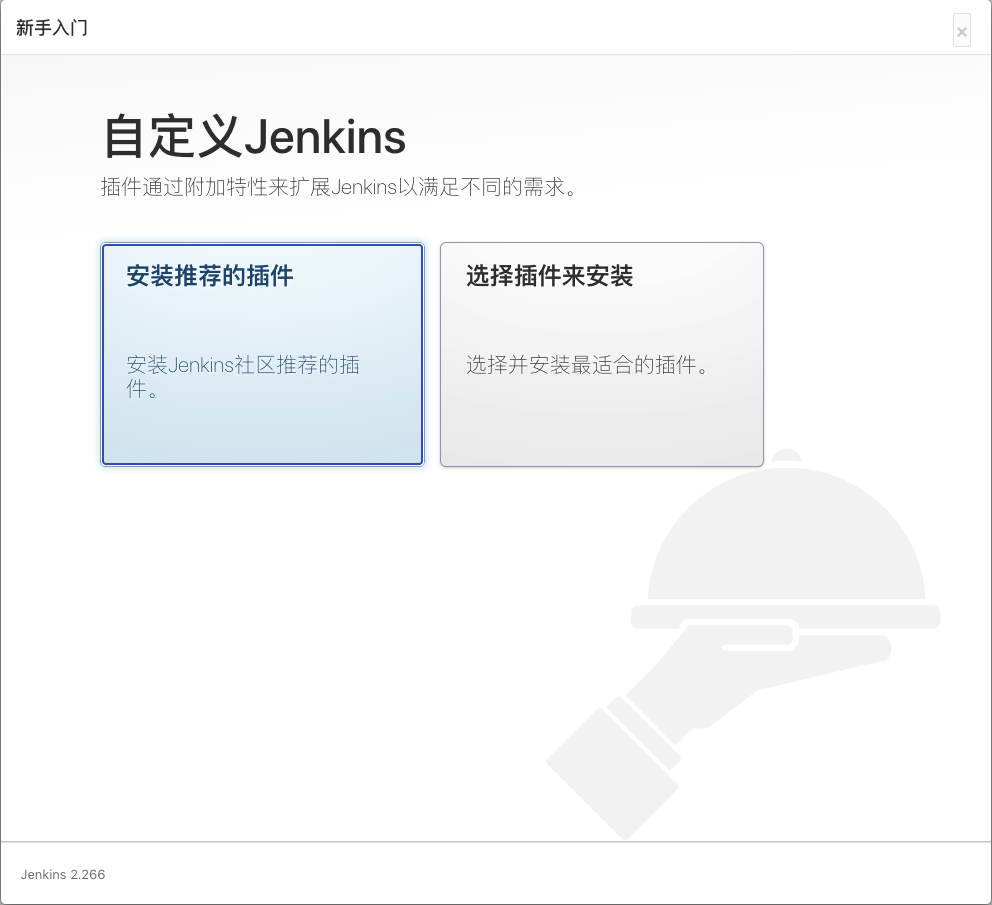
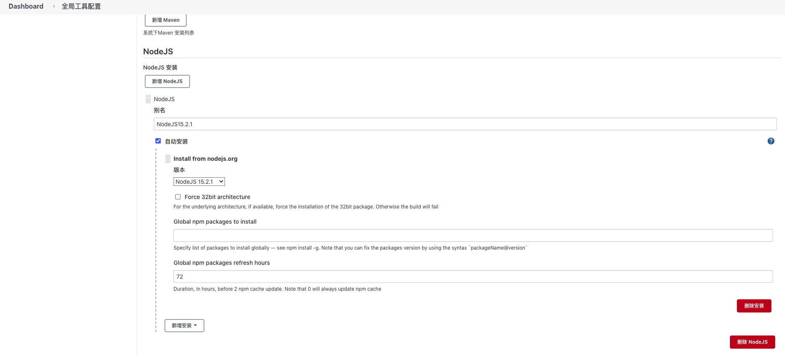
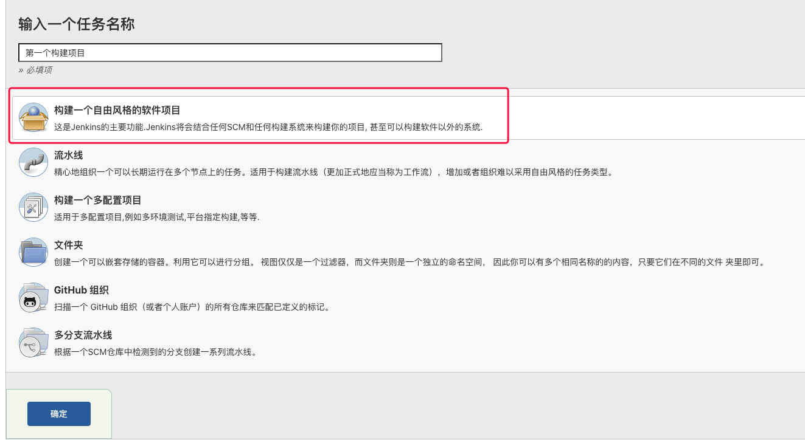
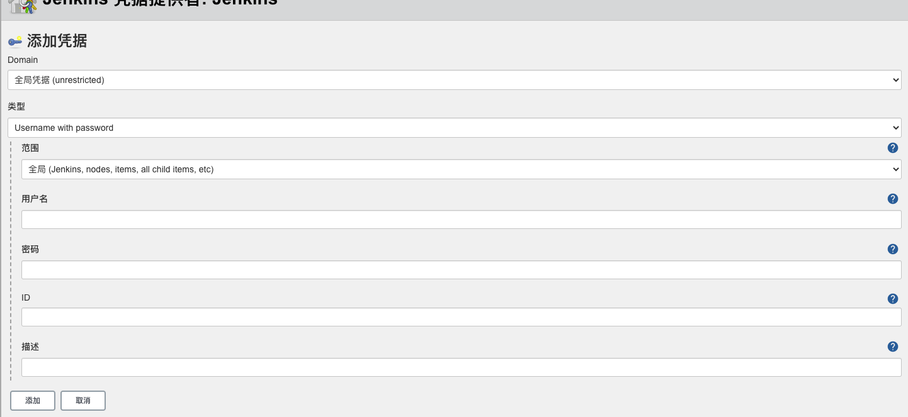
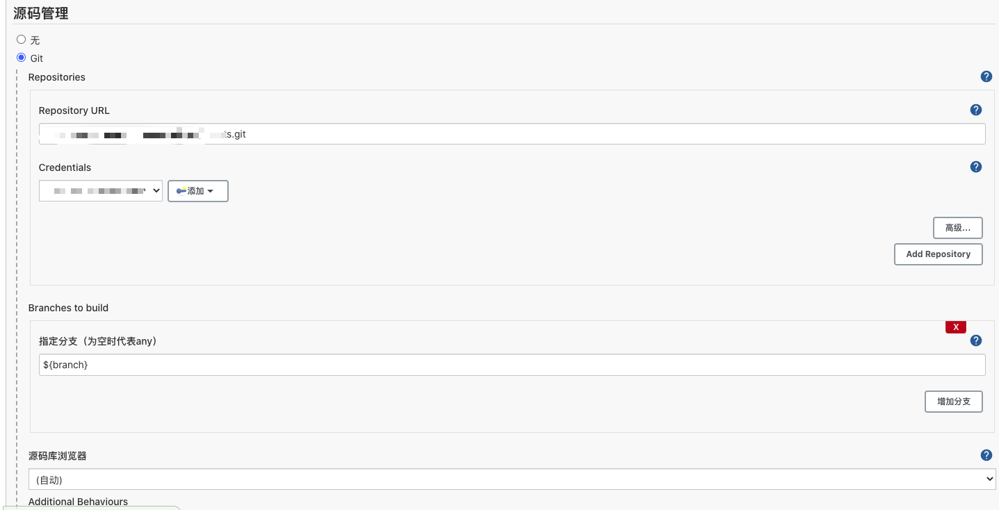
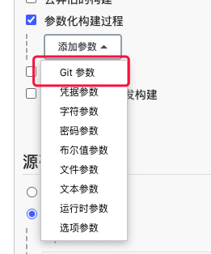
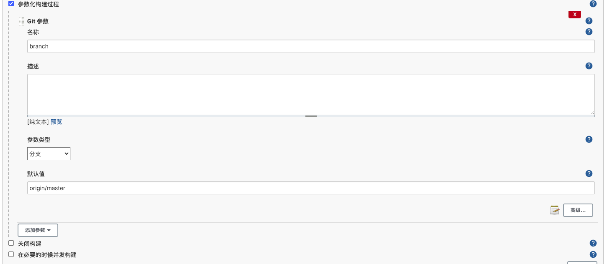
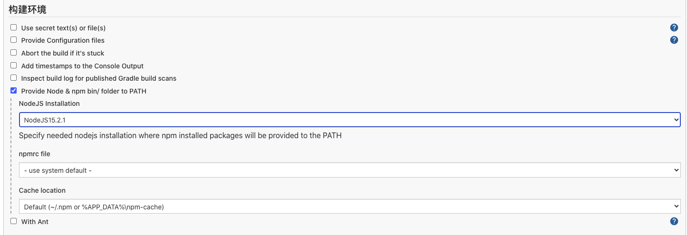
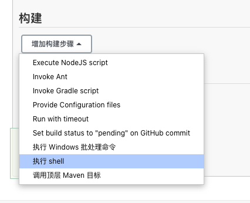

# Docker安装Jenkins
## 下载Jenkins
从[官网地址](https://www.jenkins.io/download/)进入，在下载的选项当中点击`Docker`,就会跳转到`Docker Hub`，或者直接在服务器当中输入命令
```shell
$ docker pull jenkins/jenkins
```
> Docker安装不做多介绍

当我们查看镜像的时候能找到`Jenkins`之后，我们就算已经安装好了
```shell
# 安装后
miepiadeMacBook-Pro:~ xcguan$ docker images
REPOSITORY          TAG                 IMAGE ID            CREATED             SIZE
jenkins/jenkins     latest              13e2b551515d        6 days ago          717MB
```

## 运行Jenkins
```shell
$ docker run \
  -u root \
  -d \
  -p 22222:8080 \
  -p 55555:50000 \
  -v jenkins-data:/var/jenkins_home \
  jenkins/jenkins
```

- -d  # 后台运行

- -p 22222:8080 # 映射容器的端口8080到主机上的端口22222，主机端口随意处理，官方推荐-p 8080:8080

- -p 55555:50000  # 映射容器的端口50000到主机上的端口55555，官方推荐-p 50000:50000

- -v jenkins-data:/var/jenkins_home # 设置映射磁盘

  ```shell
  miepiadeMacBook-Pro:~ xcguan$ docker run \
  >   -u root \
  >   -d \
  >   -p 22222:8080 \
  >   -p 55555:50000 \
  >   -v jenkins-data:/var/jenkins_home \
  >   jenkins/jenkins
  1fc8c3ad57c1bbb708cd4201eb1559c8f08ed4d8b5eb7269fa1f3847bf0393f2
  ```

运行完成之后，没有其他报错显示一串字符后，在浏览器中输入地址，端口号为 22222，进入后可以看到要输入密码



查看密码的两种方式

1. ```shell
   miepiadeMacBook-Pro:~ xcguan$ docker logs 1fc8c3 # 1fc8c3 是我 docker 镜像的 id，其实没有别的镜像只输第一个字也可以

   Running from: /usr/share/jenkins/jenkins.war
   省略......

   *************************************************************
   *************************************************************
   *************************************************************

   Jenkins initial setup is required. An admin user has been created and a password generated.
   Please use the following password to proceed to installation:

   # 在这边的就是密码，战术打码#

   This may also be found at: /var/jenkins_home/secrets/initialAdminPassword

   *************************************************************
   *************************************************************
   *************************************************************

   省略......

   ```

2. ```shell
   miepiadeMacBook-Pro:~ xcguan$ docker exec -it -u 0 1fc8c3 /bin/bash # 进入镜像 bash
   root@1fc8c3ad57c1:/# cat var/jenkins_home/secrets/initialAdminPassword # 就是上一条战术打码下面的路径
   # 在这边的就是密码，战术打码#
   ```

    输入后直接点击安装推荐插件，更加方便




安装完成后，就是一些配置信息和账号注册，跳过或者默认都是可以的

## 构建项目

#### 安装Git Parameter，NodeJs

提前安装一下插件` Git Parameter`、`NodeJs`，进入`系统管理->插件管理`，先不进行下载，切换到`高级`选项，滑到最下面的升级站点，修改 URL

```
https://mirrors.tuna.tsinghua.edu.cn/jenkins/updates/update-center.json
```

###### 详细的Jenkins的镜像地址查询：http://mirrors.jenkins-ci.org/status.html

提交后再选择可选插件搜索`Git Parameter`、`NodeJs`，勾选后点击直接安装，进入下一个页面后勾选自动重启就行，安装完成后会自动刷新页面

> 经常会下载不成功，多试几次总会可以的

#### 配置 NodeJs

进入全局配置工具，在`NodeJs`项下点击`新增NodeJS`，填了别名之后点击保存，另外`Node`版本不要选择太高，本人选择的是 10.13.0



#### 构建配置

点击新建任务，输入任务名称，选择构建一个自由风格的软件项目，再点击确定



源码管理中选择`Git`，输入仓库地址，在`Credentials`下面点击添加



输入你的`git`用户名密码即可，然后点击添加，添加后`Credentials`下选择你新添加的凭证即可，下面的指定分支先填写`${branch}`，下一步有作用，如果不喜欢这个名字可以根据下一步修改



再回到上面，参数化构建过程打钩选上，添加参数 点击 Git 参数，这个选项必须安装上面提到的`Git Parameter`插件才有



在名称填写 `branch`或者喜欢的名字，参数类型选择`分支`，默认值填写`origin/master`



再在构建环境当中，勾选`Provide Node & npm bin/ folder to PATH`



最后在构建当中选择`执行shell`



在命令里面输入

```shell
npm install
rm -rf ./dist/*
npm run build
rm -rf /[自定义Jenkins数据卷地址]/*
cp -rf ./dist/* /[自定义Jenkins数据卷地址]
```

完成后保存，回到工程，这时候找到 `Build with Parameters`，点击后会去查询分支，选择想要的分支，然后再点击开始构建即可。第一次构建时间会很慢，可以慢慢等待