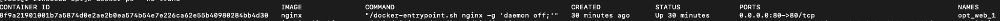

# Docker迁移镜像

## Docker Import Export

### COMMAND

在导出之前，需要先查看之前容器的`COMMAND`

这里我用最新搭的`nginx`做例子

需要注意的是，直接使用`docker ps`查看`COMMAND`会出现折叠情况


```shell
CONTAINER ID        IMAGE               COMMAND                  CREATED             STATUS              PORTS                                               NAMES
8f9a21901001        nginx               "/docker-entrypoint.…"   15 seconds ago      Up 14 seconds       0.0.0.0:80->80/tcp                                  opt_web_1
```

所以这时候我们需要在后面加`--no-trunc`来保证没有折叠

```shell
$ docker ps --no-trunc
```



```shell
CONTAINER ID                                                       IMAGE               COMMAND                                          CREATED             STATUS              PORTS                                               NAMES
8f9a21901001b7a5874d0e2ae2b0ea574b54e7e226ca62e55b40980284bb4d30   nginx               "/docker-entrypoint.sh nginx -g 'daemon off;'"   30 minutes ago      Up 30 minutes       0.0.0.0:80->80/tcp                                  opt_web_1
```

`"/docker-entrypoint.sh nginx -g 'daemon off;'"`就是我们需要的`COMMAND`参数

### Export

查询完参数我们就可以把容器打包成镜像了

```shell
$ docker export 8f9a21901001 > nginx.tar # 8f9a21901001是容器ID，nginx.tar是打包文件名称，可以是路径
```

因为我没有指定路径，所以完成后在当前目录中生成`nginx.tar`文件

### Import

导入的写法目前我看到了两种

```shell
$ cat nginx.tar | docker import - nginx-web:0.1 # cat [文件] | docker import - [新镜像名称]:[新镜像TAG]
$ # 或者
$ docker import nginx.tar nginx-web:0.1 # docker import [文件] [新镜像名称]:[新镜像TAG]
```

导入后查看镜像会发现镜像已经导入了

```shell
REPOSITORY                     TAG                 IMAGE ID            CREATED             SIZE
nginx-web                      0.1                 9b947e4f51fd        8 minutes ago       132MB
```

## Docker Load Save

可以使用`commit`命令将现在已经存在的容器打包成镜像

```shell
$ docker commit 2068543cf2f2 nginx-web2 # docker commit [容器ID] [镜像名称]
```

再使用`docker images`查看镜像列表

### Save

将镜像保存下来

```shell
$ docker save nginx-web2 > nginx-web2.tar
```

### Load

将镜像重新加载

```shell
$ docker load < nginx-web2.tar
```

## 运行镜像

因为只是一个镜像，之前设置的端口，挂载目录还需要重新设置

```shell
$ docker run \
  -d \ # 后台启动
  -p 80:80 \ # 端口映射
  -v /opt/nginx-html:/usr/share/nginx/html:ro \ # 挂载数据卷
  nginx-web:0.1 \ # 镜像名称:镜像TAG
  /docker-entrypoint.sh nginx -g 'daemon off;' # 启动参数，必填，为之前容器的COMMAND
```

## Save和Export区别

1. export导出的镜像文件大小小于save保存的镜像
2. export 导出（import导入）是根据容器拿到的镜像，再导入时会丢失镜像所有的历史，所以无法进行回滚操作（docker tag <LAYER ID> <IMAGE NAME>）；而save保存（load加载）的镜像，没有丢失镜像的历史，可以回滚到之前的层（layer）。
