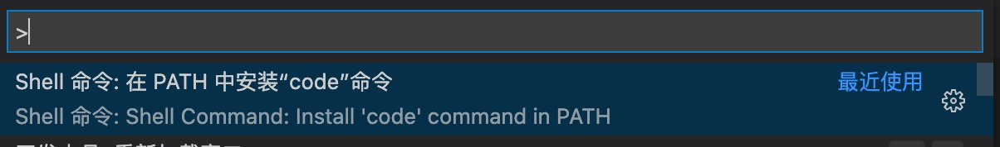

# 制作VSCode插件
## 安装依赖
```shell
$ npm install -g yo generator-code
```
最后安装完成后会有`Yeoman Doctor`一直卡着进度，可以直接跳出进程
## 生成项目
### 安装code命令
如果在下一步想用到`code`命令直接打开`VSCode`编辑器的，可以安装一下，没有需要想自己把文件拖进编辑器中的可以跳过这步

选择👆的命令，安装code

### 生成项目
```shell
$ yo code
# ? What type of extension do you want to create? New Extension (TypeScript)
# ? What's the name of your extension? HelloWorld
# ? What's the identifier of your extension? helloworld
# ? What's the description of your extension?
# ? Initialize a git repository? Yes
# ? Bundle the source code with webpack? No
# ? Which package manager to use? npm
$ code ./helloworld # 看情况需不需要执行
```
## 运行项目
将项目放进VSCode编辑器内，然后按`F5`或者直接启用调试